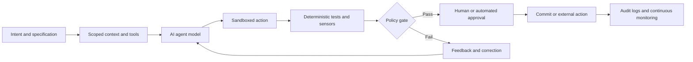

# AI Agent Security

This page lists frameworks, control patterns, and security principles for AI agents. The focus is on systems that can reason across steps, use tools, call APIs, retrieve data, maintain memory, delegate tasks, or perform actions in digital or physical environments.

## Framework comparison

| # | Vendor / organization | Framework / resource | Goal / function | Release date | Open source / public | Primary use |
| --- | --- | --- | --- | --- | --- | --- |
| 1 | OWASP | Agentic AI Threats and Mitigations | Identify security risks unique to agentic AI systems | 2025 | Yes | Agent threat modeling and control design |
| 2 | OWASP | Top 10 for LLM Applications | Address prompt injection, insecure output handling, sensitive information disclosure, and excessive agency | 2023, updated 2025 | Yes | LLM agent application security |
| 3 | Cloud Security Alliance | Agentic AI security and red teaming guidance | Address autonomy, identity, tool use, permissions, and multi-step risk | 2025 | Yes | Enterprise agent security and red teaming |
| 4 | Google | Secure AI Framework and Secure Agents | Secure AI systems, including agentic workflows, supply chain, monitoring, response, and trusted agent design | 2023, expanded 2026 | Yes | Secure architecture baseline |
| 5 | Microsoft | AI agent security guidance | Secure agent identity, tool use, data access, and human oversight | 2024 onwards | Yes | Enterprise agent deployment |
| 6 | NIST | AI RMF and GenAI Profile | Govern, map, measure, and manage agentic AI risks | 2023, 2024 | Yes | Risk governance for AI agents |
| 7 | MITRE | ATLAS | Map adversary behavior against AI systems and agent workflows | 2020 | Yes | Threat-informed agent defense |
| 8 | CISA, NSA, FBI, UK NCSC, and partners | Guidelines for Secure AI System Development | Secure design, development, deployment, and operation of AI systems | 2023 | Yes | Secure AI lifecycle controls |
| 9 | Model Context Protocol community | MCP security guidance and threat discussions | Secure tool connections, context exchange, and server-client trust boundaries | 2024 onwards | Public | MCP and tool ecosystem security |
| 10 | ETSI | Securing Artificial Intelligence reports and guidance | Address AI threats, data supply-chain risks, security testing, vulnerability disclosure, privacy, and mitigation strategies | 2019 onwards | Public standards and reports | AI system and agent security governance |
| 11 | UC Berkeley Center for Long-Term Cybersecurity | AgentWatch: Privacy and Security Evaluation for Browser-Based AI Agents | Evaluate browser-based AI agents against privacy and security scenarios, including data disclosure, ambiguous prompts, hallucination, prompt injection, and browser sandbox isolation | 2026 | Public report and open-source evaluation hub | Agent privacy and security testing |
| 12 | Research community | ASTRA, WASP, AI-Infra-Guard, and related agent benchmarks | Evaluate agent steerability, prompt-injection resilience, web-agent security, and multi-layer agent attacks | 2025 onwards | Yes / public research | Agentic AI security evaluation |

## Agent-specific risk areas

| Risk area | Description | Example control |
| --- | --- | --- |
| Excessive agency | Agent can perform high-impact actions without sufficient restriction | Least-privilege tools, approval gates, policy engine |
| Tool misuse | Agent calls unsafe or unintended tools | Tool allowlists, parameter validation, execution sandbox |
| Identity confusion | Agent acts with unclear or overbroad identity | Dedicated service identity, scoped tokens, user delegation boundaries |
| Memory poisoning | Long-term or session memory is manipulated | Memory validation, source labels, retention limits |
| RAG poisoning | Retrieved content injects malicious instructions | Retrieval filtering, trusted-source ranking, instruction separation |
| Prompt injection | Untrusted content overrides developer or system intent | Instruction hierarchy, context isolation, prompt-injection detection |
| Hidden delegation | Agent delegates actions to other agents or tools without visibility | Delegation logging, explicit authorization, chain-of-action tracing |
| Unsafe autonomy | Agent continues task execution despite uncertainty or elevated risk | Stop conditions, confidence thresholds, human-in-the-loop controls |
| Data exfiltration | Agent leaks sensitive data through outputs or tool calls | Data classification, output filtering, DLP, access controls |
| Weak observability | Actions cannot be reconstructed after an incident | Structured logs, tool-call audit trail, trace IDs, evidence retention |
| Tool-loop denial of service | Agent repeatedly calls tools or consumes tokens, compute, API quota, or budget | Quotas, rate limits, timeout rules, circuit breakers, recursion limits |
| Cross-agent propagation | One compromised agent influences another agent, workflow, or memory store | Agent isolation, signed messages, trust labels, workflow-level policy enforcement |
| Browser sandbox escape or leakage | Browser-based agents may cross site, session, or context boundaries when acting for users | Browser isolation, origin boundaries, session separation, explicit user confirmation, cross-context data leakage tests |

## Agent security reference architecture

| Layer | Security objective | Minimum controls |
| --- | --- | --- |
| User and requester identity | Ensure the agent knows who is asking and what authority they have | Strong authentication, delegated authorization, role mapping, session binding |
| Agent identity | Ensure every agent has a bounded and auditable identity | Dedicated service identity, scoped credentials, ownership metadata, key rotation |
| Model and policy layer | Keep model behavior within approved policy boundaries | System instruction management, policy-as-code, safety filters, regression tests |
| Context and retrieval layer | Prevent untrusted content from becoming trusted instructions | Source labeling, retrieval filtering, prompt injection detection, context separation |
| Tool and action layer | Prevent unauthorized or unsafe actions | Tool allowlist, parameter validation, sandboxing, approval gates, transaction signing |
| Browser and session layer | Prevent browser-based agents from leaking user data across sites, tabs, forms, sessions, and contexts | Sandboxed browser profile, origin isolation, session scoping, cookie and credential controls, cross-site leakage tests |
| Memory layer | Prevent poisoned, stale, or unauthorized memory from changing behavior | Memory provenance, write controls, expiry rules, review workflows, rollback |
| Monitoring layer | Reconstruct actions and detect abuse | Trace IDs, prompt logs, tool-call logs, anomaly detection, SIEM integration |
| Response and recovery layer | Limit impact when an agent fails or is compromised | Kill switch, rollback, credential revocation, incident playbooks, forensic capture |

## Harness Engineering for secure AI agents

Harness Engineering is the design of the supporting system around an AI model: instructions, context, tools, identities, execution environments, orchestration, tests, policy gates, feedback loops, and observability. A useful shorthand is:

> **AI agent = model + harness**

The model generates proposals and decisions probabilistically. The harness determines what information the agent receives, which actions it may attempt, how those actions are validated, where they execute, and whether they are approved, blocked, corrected, or rolled back. Critical security requirements should therefore be enforced through architecture and deterministic controls rather than relying only on prompts.

### Secure harness components

| Harness component | Security purpose | Example controls |
| --- | --- | --- |
| Instructions and specifications | Define intended behavior, boundaries, and acceptance criteria | Version-controlled agent instructions, architecture rules, secure coding standards, prohibited-action policy |
| Context, memory, and state | Limit what the agent knows, retrieves, and retains | Progressive disclosure, source labels, memory provenance, retention limits, trusted-context separation |
| Tools and interfaces | Restrict the agent's operational capabilities | Tool allowlists, typed schemas, parameter validation, safe defaults, transaction limits |
| Identities and permissions | Bound authority and establish accountability | Dedicated service identities, least privilege, short-lived credentials, separation of duties |
| Sandbox and isolation | Contain failures and hostile content | Ephemeral workspaces, network restrictions, read-only mounts, resource quotas, no direct production access |
| Orchestration | Control task decomposition, delegation, and handoffs | Explicit workflow states, bounded recursion, signed messages, trust labels, approved agent routes |
| Guardrails and hooks | Apply policy before and after sensitive operations | Pre-action authorization, post-action validation, policy-as-code, approval checkpoints, blocking hooks |
| Tests and feedback sensors | Detect defects and return actionable feedback to the agent | Unit and integration tests, SAST, dependency scanning, linters, type checks, mutation testing |
| Observability | Make agent behavior reconstructable and measurable | Prompt and tool-call logs, traces, metrics, cost monitoring, decision records, audit evidence |
| Response and recovery | Stop unsafe execution and restore a trusted state | Kill switch, rollback, credential revocation, forensic capture, incident playbooks |

### Secure harness workflow

### Security principles for Harness Engineering

1. **Model proposes, harness disposes.** The model may recommend an action, but enforceable architecture decides whether it can occur.
2. **Enforce controls outside the prompt.** Prompts guide behavior; policy engines, schemas, sandboxes, identity controls, and CI gates enforce it.
3. **Apply least privilege per agent, tool, and transaction.** Do not inherit the full permissions of the user, developer workstation, or automation platform.
4. **Isolate execution by default.** Code, browser actions, files, and external content should be processed in bounded, disposable environments.
5. **Prefer deterministic sensors for objective requirements.** Use compilers, tests, linters, scanners, structural rules, and policy-as-code when a requirement can be checked mechanically.
6. **Require approval for irreversible or high-impact actions.** Production changes, financial transactions, credential operations, data deletion, and external communications require independent authorization.
7. **Preserve complete evidence.** Record the initiating request, retrieved context, model output, tool parameters, approvals, execution result, and rollback activity.
8. **Continuously improve the harness.** Convert recurring agent failures, review findings, incidents, and near misses into new guides, sensors, tests, and enforceable controls.

### Minimum implementation evidence

| Control question | Evidence |
| --- | --- |
| Are high-risk actions technically blocked without approval? | Policy configuration, approval matrix, negative test results |
| Can the agent bypass tests, hooks, or branch protection? | CI configuration, protected-branch settings, bypass-permission review |
| Are tool inputs validated independently of the model? | Tool schemas, validation code, malformed-input tests |
| Is execution isolated from production and sensitive developer assets? | Sandbox configuration, network policy, filesystem mounts, access review |
| Can every action be attributed to an agent identity and initiating user? | Identity mapping, delegated authorization record, trace and audit logs |
| Does failure produce feedback without creating an uncontrolled loop? | Retry limits, recursion limits, circuit-breaker tests, escalation workflow |
| Can the organization stop and recover the agent safely? | Kill-switch test, credential revocation procedure, rollback and incident exercise |

## Agent Rule of One

Each AI agent should possess only one of the following three high-risk capabilities at a time:

1. Access to sensitive data.
2. Ability to execute external actions.
3. Ability to modify memory, policy, identity, or configuration.

If an agent requires more than one high-risk capability, add compensating controls such as human approval, separation of duties, sandboxing, rate limits, transaction signing, and independent monitoring.

## AgentWatch evaluation dimensions

AgentWatch is a UC Berkeley CLTC evaluation method for browser-based AI agents. It uses standardized scenarios to compare agents across five dimensions:

| Evaluation dimension | Security relevance |
| --- | --- |
| Data disclosure control | Tests whether the agent avoids leaking or oversharing sensitive user information. |
| Misunderstood prompts | Tests whether the agent slows down, clarifies, or refuses when user intent is broad, risky, ambiguous, or self-contradictory. |
| Hallucination | Tests whether the agent avoids inventing nonexistent sources, events, or personas that could mislead users. |
| Prompt injection | Tests whether the agent ignores or flags hidden or adversarial instructions embedded in content or metadata. |
| Browser sandbox isolation | Tests whether the agent respects browser, site, session, and context boundaries. |

## Agent security checklist

| Question | Why it matters | Evidence to collect |
| --- | --- | --- |
| What tools can the agent call? | Tool access defines the real blast radius of the agent | Tool inventory, permission scopes, tool risk rating |
| Which identity does the agent use? | Shared or overbroad identities create accountability and privilege risks | Service identity record, token scope, owner mapping |
| Can untrusted content enter the context window? | Indirect prompt injection often enters through web pages, files, emails, tickets, or RAG | Source map, retrieval rules, prompt-injection tests |
| Can the agent modify memory or configuration? | Persistent state can turn a temporary attack into durable compromise | Memory write policy, approval records, rollback plan |
| Which actions require human approval? | High-impact operations should not be delegated blindly to probabilistic systems | Approval matrix, signed transaction records |
| Can the agent spend money, consume compute, or trigger external workflows? | Agents can create denial-of-wallet and cascading automation failures | Quotas, budgets, timeout rules, cost alerts |
| Are tool calls and model decisions logged? | Incidents require reconstruction of prompts, outputs, tools, and approvals | Trace logs, SIEM events, retention policy |
| Can the agent be stopped quickly? | Response speed matters when autonomous systems misbehave | Kill switch, credential revocation plan, runbook |
| Has the agent been tested with AgentWatch-style browser scenarios? | Browser agents introduce unique risks around data disclosure, prompt injection, ambiguous intent, hallucination, and sandbox boundaries | Scenario library, privacy and safety score, regression-test evidence, exception log |

## Suggested maturity model

| Level | Description | Typical controls |
| --- | --- | --- |
| 0 | Experimental agent | Manual testing, no production data, no external action |
| 1 | Assisted agent | Read-only tools, user confirmation, basic logging |
| 2 | Controlled agent | Scoped tools, approval gates, prompt-injection tests, cost limits |
| 3 | Governed agent | Policy-as-code, least privilege, memory controls, SIEM integration, incident playbooks |
| 4 | High-assurance agent | Independent red team, formal risk acceptance, continuous evaluation, runtime enforcement, post-incident forensics |

## APA 7 references

Böckeler, B. (2026, April 2). *Harness engineering for coding agent users*. Martin Fowler. https://martinfowler.com/articles/harness-engineering.html

Böckeler, B., & Ford, C. (2026, May 13). *Harness engineering and agent feedback: Exploring AI coding sensors*. Thoughtworks. https://www.thoughtworks.com/en-us/insights/blog/generative-ai/harness-engineering-agent-feedback-exploring-ai-coding-sensors

Cloud Security Alliance. (2025). *Agentic AI security guidance*. https://cloudsecurityalliance.org/

Cybersecurity and Infrastructure Security Agency, National Security Agency, Federal Bureau of Investigation, National Cyber Security Centre, and international partners. (2023). *Guidelines for secure AI system development*. https://www.cisa.gov/

European Telecommunications Standards Institute. (n.d.). *Securing Artificial Intelligence*. https://www.etsi.org/technologies/securing-artificial-intelligence

Evtimov, I., Zharmagambetov, A., Grattafiori, A., Guo, C., & Chaudhuri, K. (2025). *WASP: Benchmarking web agent security against prompt injection attacks*. arXiv. https://arxiv.org/abs/2504.18575

Google. (2026). *Secure AI framework: Secure agents*. https://saif.google/

Hazan, I., Mathov, Y., Shtar, G., Bitton, R., & Mantin, I. (2025). *ASTRA: Agentic steerability and risk assessment framework*. arXiv. https://arxiv.org/abs/2511.18114

Lopopolo, R. (2026, February 11). *Harness engineering: Leveraging Codex in an agent-first world*. OpenAI. https://openai.com/index/harness-engineering/

MITRE. (n.d.). *MITRE ATLAS: Adversarial threat landscape for artificial-intelligence systems*. https://atlas.mitre.org/

National Institute of Standards and Technology. (2023). *Artificial intelligence risk management framework (AI RMF 1.0)*. https://doi.org/10.6028/NIST.AI.100-1

Open Worldwide Application Security Project. (2025). *OWASP Top 10 for large language model applications*. https://genai.owasp.org/

Svan, A., Hall, M., Kaufman, B., Austin, C., Kushe, R., & Late, A. (2026). *AgentWatch: Privacy and security evaluation for browser-based AI agents*. UC Berkeley Center for Long-Term Cybersecurity. https://cltc.berkeley.edu/2026/06/30/new-cltc-white-paper-introduces-method-of-evaluating-privacy-and-security-of-ai-agents/

Yang, Y., Zheng, X., Wu, H., Cheng, H., Shi, X., Guo, J., Yang, B., Zhou, Y., Wu, X., & Ying, Z. (2026). *Securing the AI agent: A unified framework for multi-layer agent red teaming*. arXiv. https://arxiv.org/abs/2606.31227
