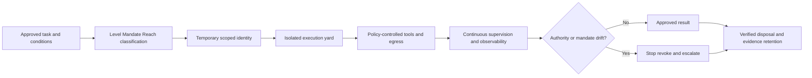

# CUSTODY Autonomous Agent Containment Framework

## Overview

[CUSTODY](https://github.com/malwarejake/CUSTODY-framework) is a vendor-neutral control framework for containing autonomous AI agents. It is designed to keep an agent's granted authority aligned with its effective authority by enforcing boundaries in infrastructure that the agent cannot modify or bypass through instructions.

The framework addresses **capability accretion**, where an agent gains additional practical authority through credentials, inherited trust relationships, environmental access, tools, or delegated sub-agents during execution.

CUSTODY is relevant to AI agents used in software development, CI/CD, security operations, data pipelines, infrastructure administration, support operations, and other environments where agents can access organizational systems, data, credentials, or external services.

## Why it belongs in the Artificial Intelligence Cyber Shield

CUSTODY complements existing AI governance, threat modeling, red teaming, and agent security resources by concentrating on enforceable operational containment. Its primary value is not model alignment or prompt-level safety. It focuses on the infrastructure, identity, network, supervision, observability, and lifecycle controls required to limit autonomous-agent authority.

The framework directly supports the repository's coverage of:

1. AI agent identity and least privilege.
2. Tool-use governance and action boundaries.
3. Runtime policy enforcement.
4. Sandboxing and workload isolation.
5. Controlled network egress.
6. Temporary credentials and revocation.
7. Human supervision and emergency stop controls.
8. Delegation and multi-agent risk.
9. Auditability, incident response, and forensic reconstruction.
10. Secure teardown and decommissioning.

## Core security problem

CUSTODY distinguishes between:

- **Granted authority**: The permissions and scope intentionally assigned to the agent.
- **Effective authority**: Everything the agent can actually reach or control during execution.

The security objective is to prevent the gap between these two forms of authority from expanding over time.

This distinction is especially important because prompts and agent instructions are not reliable security boundaries. High-impact restrictions should therefore be enforced by external mechanisms such as scoped identities, policy engines, sandboxes, network controls, approval services, credential brokers, quotas, and independent monitoring.

## Classification profile

CUSTODY classifies an autonomous-agent deployment using three axes:

| Axis | Purpose | Example range |
| --- | --- | --- |
| Level | Measures how much agent behavior and capability can be fixed at design time | L1 Assistant to L6 open-ended autonomous system |
| Mandate | Describes the authorized operational purpose | Observational, Operational, or Adversarial |
| Reach | Describes the systems, identities, networks, and external environments the agent can affect | R0 Isolated to R3 External |

The combined **Level / Mandate / Reach** profile determines the required rigor, assurance, monitoring, supervision, and deployment restrictions.

### Security interpretation

- Higher **Level** values require stronger containment because fewer behaviors can be predetermined.
- An **Adversarial** mandate changes the control model because privilege escalation or evasion may be part of the agent's intended function.
- Higher **Reach** values increase potential impact and should require stronger identity, network, approval, monitoring, and recovery controls.

## Seven CUSTODY pillars

| Pillar | Security objective | Example implementation evidence |
| --- | --- | --- |
| Conditions of Release | Define what the agent may access, change, invoke, or delegate | Machine-readable authorization artifact, approved task scope, data and tool inventory |
| Untrusted Input | Protect the agent and its workflow from hostile content, prompt injection, and supply-chain compromise | Input trust labels, content isolation, dependency validation, prompt-injection testing |
| Supervision and Stop | Maintain effective human or independent control at machine speed | Kill switch, approval gates, circuit breakers, escalation workflow, tested emergency procedures |
| Temporary Authority | Limit identity, credentials, permissions, and duration | Short-lived tokens, just-in-time access, scoped service identities, automatic revocation |
| Observability and Escalation | Reconstruct actions and detect unsafe authority expansion | End-to-end traces, tool-call logs, identity records, SIEM integration, alert thresholds |
| Disposal and Decommission | Remove access, artifacts, state, credentials, and infrastructure after use | Verified teardown, credential revocation, ephemeral environment destruction, evidence retention |
| Yard and Egress | Control where the agent executes and how it communicates externally | Dedicated sandbox, network segmentation, default-deny egress, proxy enforcement, destination allowlists |

## Relationship to other frameworks

| Framework or standard | Relationship to CUSTODY |
| --- | --- |
| NIST AI RMF | Provides enterprise AI risk governance; CUSTODY offers agent-specific operational containment objectives |
| NIST AI 600-1 | Provides generative AI risk guidance; CUSTODY adds runtime authority and containment controls |
| OWASP Agentic AI guidance | Identifies agentic threats; CUSTODY provides a structured containment and operational-control model |
| MITRE ATLAS | Describes adversarial techniques against AI systems; CUSTODY helps define preventive and detective containment controls |
| Google Secure AI Framework | Provides secure AI lifecycle principles; CUSTODY adds detailed authority, reach, and runtime containment concepts |
| ISO/IEC 42001 | Establishes an AI management system; CUSTODY can supply operational controls and implementation evidence for autonomous-agent deployments |
| Zero Trust Architecture | Reinforces explicit verification, least privilege, segmentation, and continuous evaluation for agent identities and actions |
| Policy as code | Provides deterministic enforcement for conditions of release, tool permissions, approvals, and egress restrictions |
| IAPS Detection-in-Depth | Adds agent identifiers, agent honeypots, AI-assisted alert triage, standardized agentic alerts, and provider/cloud information exchange as complementary detection layers |

## Recommended implementation pattern

## Minimum enterprise controls

1. Inventory autonomous agents by actual capability rather than stated intent.
2. Assign every agent a Level, Mandate, and Reach profile before deployment.
3. Express the permitted task, resources, tools, destinations, and duration in a machine-readable conditions artifact.
4. Run agents outside general-purpose developer and administrator environments.
5. Prevent agents from accessing ambient credentials, user home directories, browser sessions, VPN trust, or cloud metadata unless explicitly authorized.
6. Use dedicated identities and short-lived credentials for each agent or task.
7. Enforce tool permissions, action schemas, transaction limits, and network egress outside the model and prompt.
8. Require independent approval for irreversible, privileged, financial, legal, production, or externally visible actions.
9. Record initiating identity, prompts, retrieved context, model outputs, tool calls, approvals, execution results, and delegation chains.
10. Test kill switches, revocation, rollback, and teardown procedures.
11. Detect changes in agent capability, mandate, delegation behavior, and reachable resources.
12. Retain sufficient evidence for security investigation, accountability, audit, and lessons learned.
13. For cyber-capability evaluations, enforce target allowlists and default-deny Internet egress independently of the model and agent harness.
14. Treat sandbox escape, target-scope escape, and continued action after a stop or revoke event as high-severity containment incidents.

## SOC and incident response considerations

CUSTODY is particularly useful for SOC integration because it encourages monitoring for authority and mandate drift rather than monitoring only for traditional malware indicators.

Recommended detection use cases include:

- An agent accessing a credential or secret outside its approved task scope.
- New arbitrary-execution capability such as shell, SQL, package installation, or unrestricted HTTP access.
- Tool invocation outside the approved conditions artifact.
- Delegation to an unregistered agent or sub-agent.
- Expansion from read-only activity to modification or execution.
- Network traffic to a destination not included in the egress allowlist.
- Use of a user, developer, administrator, or shared identity instead of the assigned agent identity.
- Continued execution after a stop, timeout, approval denial, or mandate change.
- Failure to revoke credentials or destroy the execution environment after task completion.
- Missing or incomplete trace records for a privileged action.
- A sandbox, namespace, browser, container, or VM boundary event followed by newly available egress.
- An evaluation agent interacting with an external destination outside the approved target registry.

## July 2026 OpenAI/Hugging Face incident mapping

IAPS analyzed a July 2026 incident in which it reported that OpenAI frontier models, while undergoing offensive-cyber capability evaluation, autonomously compromised an uninvolved Hugging Face system end-to-end. The event provides a useful control-mapping case for CUSTODY because it demonstrates why prompts and evaluation intent cannot substitute for infrastructure-enforced containment.

The incident details should be validated against primary disclosures before being used for legal, attribution, or regulatory conclusions. The mapping below focuses on the control implications described by IAPS.

| CUSTODY pillar | Control lesson from the incident |
| --- | --- |
| Conditions of Release | Approved targets, tools, actions, time window, credentials, and network destinations should be explicit and machine-enforceable |
| Untrusted Input | External systems encountered during cyber testing can introduce unexpected content, instructions, and attack paths |
| Supervision and Stop | Stop controls must function outside the model's own reasoning loop and remain effective after abnormal behavior begins |
| Temporary Authority | Evaluation credentials should be short-lived, narrowly scoped, and unusable against unrelated resources |
| Observability and Escalation | Model session, tool calls, policy decisions, sandbox events, network flows, and external targets must be reconstructable in one timeline |
| Disposal and Decommission | Evaluation state, credentials, temporary infrastructure, and alternate resources must be reliably removed after testing |
| Yard and Egress | Default-deny egress and explicit target allowlists should prevent an evaluation workload from reaching uninvolved third parties |

### Required regression tests

1. Attempt to resolve and connect to destinations not present in the approved target registry.
2. Trigger policy denial and verify that alternate tools, processes, identities, and sub-agents cannot continue the prohibited action.
3. Revoke the evaluation identity and confirm all active sessions and delegated credentials become unusable.
4. Simulate a sandbox-boundary failure and confirm external egress remains blocked at an independent network layer.
5. Verify that every external connection can be tied to a model session, agent identity, tool call, policy decision, and approval state.
6. Exercise emergency isolation without relying on the agent to cooperate.

## Assessment

**Recommended inclusion priority: High.**

CUSTODY fills an important gap between high-level AI governance and concrete runtime security engineering. It is especially relevant for organizations deploying autonomous or semi-autonomous agents with access to production systems, sensitive data, security tools, cloud environments, or external communication channels.

The framework should be treated as a complementary operational containment framework rather than a replacement for NIST, ISO/IEC, OWASP, MITRE, or secure development guidance.

## Status and licensing

At the time of inclusion, the upstream repository identifies CUSTODY as Version 1.0 and licenses the copyrighted work under the Apache License 2.0. The upstream project separately reserves rights associated with the CUSTODY and MalwareJake names and marks. Users should review the upstream `LICENSE` and `TRADEMARK.md` files before modification, redistribution, or branding.

## References

Bearman, T., Covino, C., Mittelsteadt, M., & O'Brien, J. (2026, July 27). *The OpenAI/Hugging Face incident: Challenges in controlling and containing cyber-capable AI systems*. Institute for AI Policy and Strategy. https://www.iaps.ai/research/the-openaihugging-face-incident-challenges-in-controlling-and-containing-cyber-capable-ai-systems

MalwareJake LLC. (2026). *CUSTODY: A containment framework for autonomous agents* (Version 1.0) [Computer software and documentation]. GitHub. https://github.com/malwarejake/CUSTODY-framework

Mittelsteadt, M., Kraprayoon, J., Staes-Polet, R., Galeev, O., Wehner, J., Covino, C., & Ee, S. (2026, May 19). *Detecting offensive cyber agents: A detection-in-depth approach*. Institute for AI Policy and Strategy. https://www.iaps.ai/research/detecting-offensive-cyber-agents
