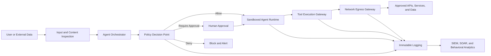

# System Hardening Against AI and Agentic AI Threats

**Author:** Yuval Sinay  
**Repository:** Artificial Intelligence Cyber Shield  
**Last updated:** July 2026

## Executive summary

AI-enabled and agentic systems can read data, invoke tools, execute code, call APIs, communicate with external services, modify infrastructure, and initiate business processes. Prompt injection, poisoned context, compromised tools, excessive permissions, malicious plug-ins, unsafe generated code, and ordinary model errors can therefore become operating-system and network security incidents.

The core security assumption should be:

> **An AI agent can be manipulated, compromised, or wrong. Its operating environment must prevent a bad decision from becoming an unrestricted system action.**

System hardening provides enforceable boundaries below the model layer. Controls such as SELinux, AppArmor, seccomp, Landlock, systemd sandboxing, Windows Application Control, AppContainer, least-privilege identities, read-only filesystems, container isolation, network segmentation, and controlled egress limit what an AI workload can access and execute.

System hardening does not determine whether an AI decision is semantically correct. It limits the consequences of failure. A complete architecture therefore combines operating-system enforcement, sandboxed execution, Zero Trust networking, scoped credentials, tool-policy enforcement, monitoring, rate limits, circuit breakers, and human approval for high-impact actions.

## 1. Security objective

The objective is not to make an AI agent fully trusted. The objective is to make it:

1. **Constrained:** able to access only the resources required for its assigned task.
2. **Isolated:** separated from the host, other agents, users, secrets, and unrelated workloads.
3. **Mediated:** unable to invoke tools or external services without an enforcement point.
4. **Observable:** every material action is attributable, logged, and correlated.
5. **Interruptible:** unsafe behavior can be stopped through quotas, circuit breakers, revocation, or process termination.
6. **Recoverable:** compromised execution environments can be destroyed and recreated from trusted images.
7. **Accountable:** high-risk actions require explicit authorization and, where appropriate, human approval.

## 2. Threat-to-control mapping

| AI or agentic threat | Potential consequence | Primary hardening controls |
| --- | --- | --- |
| Prompt injection | The agent follows malicious instructions embedded in content | Mandatory access control, tool gateway, scoped permissions, content isolation, human approval |
| Indirect prompt injection | External documents, websites, email, or retrieved data manipulate the agent | Separate data from instructions, sandbox retrieval and parsing, restrict tool access, egress control |
| Malicious generated code | The model creates or runs unsafe commands or software | Ephemeral sandbox, application allowlisting, seccomp, no shell by default, read-only root filesystem |
| Credential theft | Tokens, SSH keys, cloud credentials, or secrets are read and exfiltrated | Secret broker, short-lived credentials, SELinux/AppArmor, filesystem isolation, metadata-service blocking |
| Data exfiltration | Sensitive information is transmitted to an external destination | Default-deny egress, allowlisted gateway, DLP, request-size limits, destination and method restrictions |
| Privilege escalation | The agent or generated code gains administrator or root privileges | No-new-privileges, capability removal, non-root accounts, AppContainer, kernel hardening, application control |
| Lateral movement | The agent accesses unrelated hosts, services, agents, or administrative interfaces | Micro-segmentation, workload identity, mTLS, host firewall, network policy, per-service authorization |
| Persistence | Startup scripts, scheduled tasks, services, registry keys, or packages are modified | Immutable images, read-only system paths, deny service creation, allowlisting, drift detection |
| Tool or plug-in compromise | A trusted integration performs malicious actions | Tool isolation, signed artifacts, schema validation, least privilege, independent logging, kill switches |
| Excessive autonomous actions | The agent performs destructive or costly actions at machine speed | Rate limits, transaction limits, action budgets, approval gates, two-person control, circuit breakers |
| Cross-agent compromise | One agent reads another agent's memory, workspace, tokens, or output | Separate identities, namespaces, labels, storage volumes, queues, and network policies per agent |
| Audit evasion | The agent alters or deletes evidence of its activity | Remote immutable logging, append-only storage, signed events, separation of duties |

## 3. Reference architecture



The model should never be the final enforcement authority. The design principle is:

> **The model proposes; the architecture authorizes and enforces.**

## 4. Linux hardening

### 4.1 Dedicated identity

Run each agent class under a dedicated, non-interactive service account.

Recommended baseline:

- No root execution.
- No password and no interactive login.
- No unrestricted `sudo`.
- Separate account or workload identity for each agent role.
- Separate service accounts for orchestration, retrieval, execution, and administration.
- No shared long-lived credentials between agents.

### 4.2 SELinux

SELinux implements Mandatory Access Control and can restrict how processes interact with files, devices, sockets, ports, and other labeled resources. For agentic AI, create a dedicated domain for each materially different agent role rather than running agents in an unconfined domain.

A document-analysis agent, for example, could be allowed to:

- Read `/srv/agent/input`.
- Write only to `/srv/agent/output` and a temporary work directory.
- Execute only approved binaries used by the workflow.
- Connect only to an approved local gateway or labeled service port.

It should be denied access to:

- `/root`, user home directories, SSH keys, and browser profiles.
- Cloud credential files and local secret stores.
- Container runtime sockets such as `docker.sock` or `containerd.sock`.
- Kernel interfaces, devices, package managers, cron, and system service definitions.
- Administrative APIs and unrelated agent workspaces.

**Implementation guidance:**

1. Start the service in enforcing mode within a dedicated SELinux domain.
2. Label input, output, executable, cache, and secret paths separately.
3. Permit only the exact file types, operations, ports, and process transitions required.
4. Review AVC denials and fix labels or policy deliberately.
5. Do not automatically convert all observed denials into allow rules.
6. Test prompt-injection and malicious-file scenarios while SELinux is enforcing.

### 4.3 AppArmor

AppArmor can provide path-oriented confinement for AI services and may be simpler to deploy in environments that already use it. A profile should explicitly restrict:

- Read, write, memory-map, and execute permissions.
- Shell and interpreter invocation.
- Access to `/proc`, `/sys`, devices, and sensitive home directories.
- Network families and capabilities.
- Child-process execution and profile transitions.

Use enforce mode for production. Complain mode is useful for controlled policy development but should not be treated as production protection.

### 4.4 seccomp

seccomp filters reduce the kernel attack surface by restricting system calls available to a process. The Linux kernel documentation emphasizes that seccomp is not a complete sandbox; it should be combined with other hardening mechanisms.

For an AI execution worker, consider denying or tightly controlling system calls associated with:

- Kernel module loading.
- Mounting filesystems.
- Reboot and system administration.
- `ptrace` and process inspection.
- Namespace creation not required by the runtime.
- Raw sockets.
- Keyring manipulation.
- Rare or architecture-specific calls that the workload does not require.

Use an allowlist derived from observed legitimate behavior. Validate the profile across updates because language runtimes and libraries may introduce new system-call requirements.

### 4.5 Landlock

Landlock allows a process, including an unprivileged process, to restrict its own ambient filesystem and supported network rights. It is stackable with other Linux Security Modules and is valuable as an application-level sandboxing layer.

Potential uses include:

- Restricting generated-code workers to a temporary project directory.
- Allowing read-only access to a specific toolchain.
- Preventing access to unrelated files even when discretionary permissions would otherwise allow it.
- Limiting outbound network connections to required ports where supported.

Landlock should supplement, not replace, system-wide MAC, identity controls, seccomp, and network enforcement.

### 4.6 systemd sandboxing

When the agent runs as a systemd service, use service-level restrictions in addition to SELinux or AppArmor.

```ini
[Service]
User=ai-agent
Group=ai-agent
NoNewPrivileges=yes
PrivateTmp=yes
PrivateDevices=yes
ProtectSystem=strict
ProtectHome=yes
ProtectKernelTunables=yes
ProtectKernelModules=yes
ProtectControlGroups=yes
ProtectClock=yes
RestrictSUIDSGID=yes
LockPersonality=yes
MemoryDenyWriteExecute=yes
CapabilityBoundingSet=
AmbientCapabilities=
RestrictAddressFamilies=AF_UNIX AF_INET AF_INET6
ReadOnlyPaths=/srv/agent/input
ReadWritePaths=/srv/agent/output /var/lib/ai-agent
SystemCallArchitectures=native
UMask=0077
```

The exact directives must be tested against the application. `MemoryDenyWriteExecute=yes`, for example, may be incompatible with some just-in-time compilers. Where a control cannot be enabled, document the exception and add compensating measures.

### 4.7 Filesystem and execution controls

Recommended controls:

- Read-only root filesystem.
- Separate read-only input and write-only or controlled output locations where feasible.
- `noexec`, `nodev`, and `nosuid` mount options for temporary and data volumes.
- Ephemeral workspaces destroyed after each task.
- Signed and verified images, binaries, models, adapters, and plug-ins.
- No package installation from the agent runtime.
- No compilers, shells, or interpreters unless the task explicitly requires them.
- Separate execution worker for code-generation tasks.
- File-size, file-count, process-count, CPU, memory, and time limits.

### 4.8 Namespaces and cgroups

Use namespaces to isolate process IDs, mounts, users, IPC, hostnames, and networks. Use cgroups to constrain resource consumption.

Apply limits for:

- CPU time and shares.
- Memory and swap.
- Number of processes and threads.
- Open files.
- Disk and temporary storage.
- Network bandwidth where supported.
- Maximum task duration.

Resource limits are security controls for agentic systems because an agent can unintentionally or maliciously create loops, fork processes, consume tokens, generate excessive traffic, or fill storage.

## 5. Windows hardening

### 5.1 Dedicated service identity

Use a dedicated least-privilege service account, virtual account, managed service account, or other workload identity appropriate to the environment.

The identity should have:

- No local administrator membership.
- No interactive sign-in unless operationally essential.
- No broad network logon rights.
- Access only to required files, registry locations, services, and APIs.
- Short-lived or managed credentials rather than embedded secrets.

### 5.2 Application Control for Windows

Application Control changes the execution model from “run unless detected as malicious” to “run only when policy allows.” This is particularly important for AI agents that may attempt to invoke generated scripts, command interpreters, living-off-the-land binaries, installers, or downloaded utilities.

Use policy to control:

- Executables and dynamic libraries.
- PowerShell and other scripts.
- MSI installers and batch files.
- Approved publishers, hashes, paths, and managed installers.
- Kernel-mode code where applicable.

Deploy policies in audit mode first, review compatibility, and then move to enforcement. Do not permit broad writable paths as trusted execution locations.

### 5.3 AppContainer and process isolation

AppContainer provides a least-privilege isolation boundary based on explicitly granted capabilities. It can restrict access to files, registry objects, devices, network resources, and other processes.

For high-risk agent functions, consider:

- AppContainer-based isolation.
- Windows Sandbox or disposable virtual machines.
- Separate execution hosts for generated code.
- Protected and brokered access to enterprise resources.

### 5.4 PowerShell and administrative tooling

- Do not expose unrestricted PowerShell to the model.
- Use Constrained Language Mode where appropriate.
- Apply script signing and logging.
- Use Just Enough Administration for narrowly scoped administrative actions.
- Disable or restrict legacy scripting engines that are not required.
- Route administrative operations through a policy-enforcing broker.
- Record script blocks, module activity, process creation, and tool parameters.

### 5.5 Additional Windows controls

- Attack Surface Reduction rules.
- Windows Defender Firewall with outbound allowlisting for agent processes or hosts.
- Credential Guard and protected credential handling where applicable.
- NTFS permissions that separate input, output, executables, logs, and secrets.
- Tamper protection and centrally managed endpoint security.
- Controlled folder access for protected data locations.
- Removal of unnecessary services, protocols, and administrative shares.
- Secure Boot, TPM-backed protection, and platform integrity controls.

## 6. Container and Kubernetes hardening

Containers are not a complete security boundary by themselves. For AI agents, combine container controls with host hardening, MAC, seccomp, network policy, workload identity, and admission controls.

Recommended container baseline:

- Run as a non-root user.
- Set `allowPrivilegeEscalation: false`.
- Drop all Linux capabilities and add back only those demonstrated to be necessary.
- Use a read-only root filesystem.
- Do not use privileged containers.
- Do not use host PID, IPC, or network namespaces.
- Do not mount host paths, container runtime sockets, or service-account tokens unless required.
- Apply a restrictive seccomp profile.
- Apply SELinux or AppArmor confinement.
- Use signed, scanned, minimal images.
- Recreate rather than repair compromised workloads.

Example Kubernetes security context:

```yaml
apiVersion: v1
kind: Pod
metadata:
  name: ai-agent-worker
spec:
  automountServiceAccountToken: false
  containers:
    - name: worker
      image: registry.example/ai-agent-worker@sha256:REPLACE_WITH_DIGEST
      securityContext:
        runAsNonRoot: true
        runAsUser: 10001
        runAsGroup: 10001
        allowPrivilegeEscalation: false
        readOnlyRootFilesystem: true
        capabilities:
          drop: ["ALL"]
        seccompProfile:
          type: RuntimeDefault
      resources:
        requests:
          cpu: "250m"
          memory: "256Mi"
        limits:
          cpu: "1"
          memory: "1Gi"
      volumeMounts:
        - name: work
          mountPath: /work
  volumes:
    - name: work
      emptyDir:
        sizeLimit: 1Gi
```

### Default-deny network policy

```yaml
apiVersion: networking.k8s.io/v1
kind: NetworkPolicy
metadata:
  name: default-deny-agent
spec:
  podSelector:
    matchLabels:
      app: ai-agent
  policyTypes:
    - Ingress
    - Egress
```

Add separate, explicit allow policies only for required DNS, policy, tool-gateway, telemetry, and approved service traffic. Do not grant general Internet access directly to agent pods.

For untrusted code execution, use stronger isolation such as sandboxed runtimes, microVMs, or disposable virtual machines, especially when multi-tenant workloads or sensitive infrastructure are involved.

## 7. Network hardening and controlled egress

Operating-system controls cannot reliably determine whether an allowed API request is legitimate in business context. All agent communications should therefore pass through policy enforcement points.

### 7.1 Default-deny architecture

- Deny inbound and outbound traffic by default.
- Place agents in dedicated segments or namespaces.
- Prohibit direct Internet access.
- Allow only required protocols, destinations, methods, and ports.
- Block access to cloud instance metadata services unless explicitly required and strongly protected.
- Prevent direct access to administrative networks and control planes.
- Use workload identity and mTLS between services.

### 7.2 Agent egress gateway

The egress gateway should enforce:

1. Destination and domain allowlists.
2. DNS security and protection against rebinding.
3. TLS validation and, where appropriate, mTLS.
4. API method and path restrictions.
5. Request and response schema validation.
6. Data classification and DLP inspection.
7. Maximum request, response, and upload sizes.
8. Rate, cost, and transaction limits.
9. Blocking of unexpected redirects and alternate protocols.
10. Full traffic and policy-decision logging.

### 7.3 Tool execution gateway

An agent should not receive unrestricted shell, database, email, cloud, ticketing, or infrastructure access. Expose narrowly defined actions through a broker.

Replace broad permissions such as:

```text
Access email
Access database
Execute Python
Administer cloud resources
```

with atomic permissions such as:

```text
Read messages from mailbox X
Create an email draft but do not send it
Query approved database view Y with read-only statements
Execute a signed analysis worker with a fixed dependency set
Restart service Z only after approval
```

The gateway should validate identity, authorization, action schema, parameter values, resource scope, transaction limits, and approval state before execution.

## 8. Credential and secret hardening

AI agents should not hold broad, long-lived credentials in prompts, memory, environment variables, configuration files, or local token caches.

Use:

- A centralized secret broker.
- Short-lived credentials issued per task or action.
- Audience-restricted and scope-restricted tokens.
- Separate credentials for read and write operations.
- Automatic expiration and revocation after task completion.
- Workload identity instead of static API keys.
- Independent authorization at the destination service.
- No secret return to the model unless strictly necessary.

A secure pattern is for the agent to request an action from a broker. The broker obtains or uses the credential, performs the authorized operation, and returns only the minimum result required by the workflow.

## 9. Human approval and high-impact actions

Require explicit approval for actions with material blast radius, including:

- Changing IAM, firewall, endpoint, or security policy.
- Deleting or irreversibly modifying data.
- Creating users, tokens, keys, or privileged sessions.
- Sending external communications in the organization's name.
- Transferring funds or making purchases.
- Deploying to production.
- Accessing, exporting, or sharing sensitive data.
- Disabling monitoring or modifying logs.
- Changing the controls that restrict the agent itself.

For the highest-risk actions, use two-person approval, step-up authentication, transaction signing, and an out-of-band approval channel. Approval should bind to the exact action, parameters, target, time window, and agent identity.

## 10. Monitoring, detection, and response

Record at minimum:

- Agent and workload identity.
- User or service that initiated the task.
- Model, version, system prompt, and policy version where permissible.
- Input source and retrieved content provenance.
- Tool name, action, parameters, and result.
- Files, records, services, and destinations accessed.
- Credential issuance and revocation events.
- Policy allow, deny, and approval decisions.
- Resource consumption, rate limits, and budget use.
- Process creation, network connections, and security-control denials.

Logs should be sent off-host to immutable or append-only storage. The agent must not have permission to alter its own audit trail.

Detection use cases include:

- Repeated denied file or system-call access.
- Attempts to invoke shells, interpreters, package managers, or administrative tools.
- Sudden expansion in destinations, data volume, API calls, or action frequency.
- Access to secrets, identity systems, logs, backups, or security controls.
- Cross-agent or cross-tenant access attempts.
- Repeated approval requests after denial.
- Tool use inconsistent with the agent's declared role.

Automated response options include token revocation, network quarantine, workload termination, snapshot preservation, queue suspension, and forced human review.

## 11. Validation and red-team testing

Hardening should be validated against realistic AI-specific abuse cases.

Test whether the agent can:

1. Read SSH keys, cloud credentials, browser tokens, or unrelated user files.
2. Access `/proc`, `/sys`, kernel interfaces, devices, or runtime sockets.
3. Launch a shell or an unapproved interpreter.
4. Install packages or download and execute utilities.
5. Create persistence through services, scheduled tasks, startup paths, or registry keys.
6. Reach arbitrary Internet destinations or internal administrative systems.
7. Access the cloud metadata service.
8. Exfiltrate sensitive data through allowed protocols or destinations.
9. Modify or delete its logs.
10. Exceed CPU, memory, process, storage, API, token, or financial budgets.
11. Reuse a credential outside its action, resource, or time scope.
12. Bypass a required human approval step.
13. Access another agent's workspace, memory, queue, or credentials.
14. Escape a container, sandbox, or generated-code environment.
15. Use prompt injection to cause any of the above.

Run these tests after material changes to models, tools, plug-ins, images, policies, kernels, runtimes, and orchestration logic.

## 12. Minimum production baseline

| Control area | Minimum requirement |
| --- | --- |
| Identity | Dedicated non-root or non-administrator workload identity |
| Operating system | SELinux/AppArmor or equivalent confinement in enforcement mode |
| System calls | Restrictive seccomp or platform-equivalent policy |
| Filesystem | Read-only system paths and isolated ephemeral work directory |
| Execution | Application allowlist; no unrestricted shell or package manager |
| Credentials | Short-lived, scoped, brokered credentials |
| Network | Default-deny ingress and egress; controlled gateway only |
| Tools | Brokered atomic actions with schema and policy validation |
| Isolation | Separate agent, tool, and generated-code execution boundaries |
| Resources | CPU, memory, process, storage, time, rate, and cost limits |
| Approval | Human approval for high-impact actions |
| Logging | Off-host immutable logging of prompts, policies, tools, data access, and outcomes |
| Response | Token revocation, circuit breaker, quarantine, and kill switch |
| Testing | Prompt-injection, malicious-content, tool-abuse, escape, and exfiltration tests |

## 13. Important limitation

System hardening can stop an action that is technically unauthorized. It may not stop a harmful action that remains inside the agent's legitimate permissions.

For example, if an agent is authorized to read an entire customer database and upload files to an approved service, operating-system controls may not know whether a specific upload is justified. This is why system hardening must be combined with business-level authorization, DLP, transaction policy, contextual validation, rate limits, monitoring, and approval workflows.

The desired security stack is:

> **Mandatory Access Control + sandboxed execution + Zero Trust networking + scoped identity + tool-policy enforcement + human oversight.**

## 14. References

Kubernetes. (2026). *Network policies*. https://kubernetes.io/docs/concepts/services-networking/network-policies/

Linux Kernel Documentation. (2026). *Landlock: Unprivileged access control*. https://docs.kernel.org/userspace-api/landlock.html

Linux Kernel Documentation. (2026). *Seccomp BPF: Secure computing with filters*. https://docs.kernel.org/userspace-api/seccomp_filter.html

Microsoft. (2026). *AppContainer isolation*. Microsoft Learn. https://learn.microsoft.com/en-us/windows/win32/secauthz/appcontainer-isolation

Microsoft. (2026). *Application Control for Windows*. Microsoft Learn. https://learn.microsoft.com/en-us/windows/security/application-security/application-control/app-control-for-business/appcontrol

Red Hat. (2026). *Using SELinux: Red Hat Enterprise Linux 9*. https://docs.redhat.com/en/documentation/red_hat_enterprise_linux/9/html/using_selinux/index

Rose, S., Borchert, O., Mitchell, S., & Connelly, S. (2020). *Zero trust architecture* (NIST Special Publication 800-207). National Institute of Standards and Technology. https://doi.org/10.6028/NIST.SP.800-207

## Citation

Sinay, Y. (2026). *System hardening against AI and agentic AI threats*. Artificial Intelligence Cyber Shield. https://github.com/yuval14/Artificial-Intelligence-Cyber-Shield/blob/master/System-Hardening/System-Hardening-Against-AI-Threats.md
